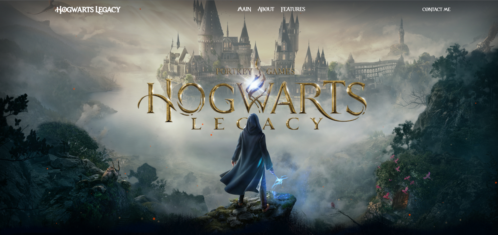

# Hogwarts Legacy - Parallax Experience

Welcome to the Hogwarts Legacy project! This is an interactive canvas-based web experience that utilizes parallax effects to bring the magical world of Hogwarts to life.

## Features

- **Interactive Parallax Scrolling**: Engage with the Hogwarts universe through a seamless parallax scrolling effect that immerses you in the world.
- **Canvas Animations**: Witness the magic with captivating animations that respond to user interactions.
- **Responsive Design**: Enjoy the experience across a variety of devices, ensuring a magical journey on any screen size.

## Technologies Used

- **HTML5 Canvas**: For rendering interactive animations and parallax effects.
- **SCSS**: For styling and ensuring a responsive design.
- **JavaScript**: To create interactive elements and manage parallax layers.

## Acknowledgments

- Thanks to J.K. Rowling for inspiring the world with the magical universe of Harry Potter.
- Shoutout to all the contributors who have invested their time to improve this project.

---

## Setup

Clone the repository and run the following command to start the development server:
git clone https://github.com/Vergos1/project_hogwarts-parallax.git 

## Created by
Design and any crafted with 💜 by [Ihor Yanchuk](https://github.com/Vergos1). For more information or to view my other work, please visit [my portfolio](http://yanchuk.vinnytsia.ua/).

